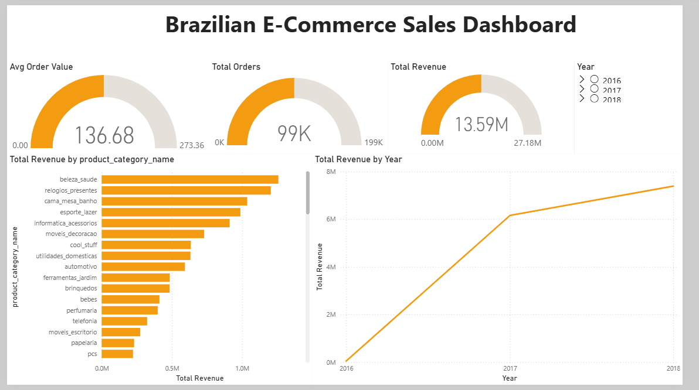
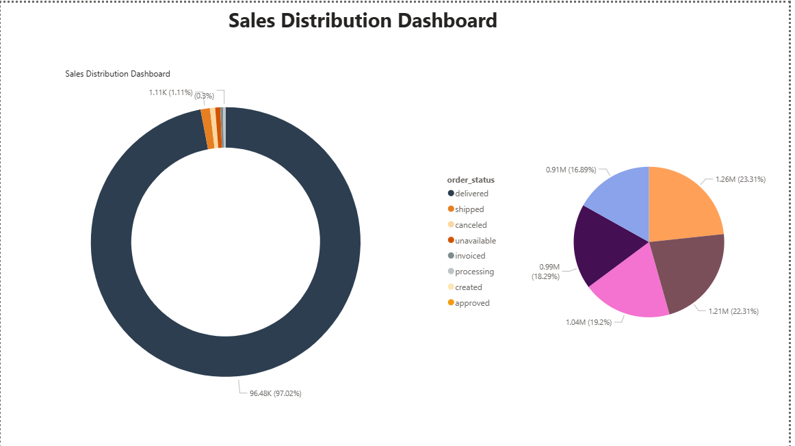

# 📊 Brazilian E-Commerce Sales Analysis

## 🔍 Overview

End-to-end data analysis project using SQL, Python, Excel, and Power BI to uncover business insights from a large Brazilian e-commerce dataset.
Dataset contains 100K+ e-commerce records including orders, customers, and products.

---

## 🛠️ Tools Used

* SQL (MySQL)
* Python (Pandas, NumPy, Matplotlib, Seaborn)
* Excel
* Power BI

---

## 📊 Dashboard Preview

---

## 📈 Key Insights

* Identified top revenue-generating product categories
* Analyzed monthly sales trends and seasonal patterns
* Evaluated customer purchasing behavior
* Measured delivery performance and delays

---

## 📂 Project Components

* **SQL** → Data querying and analysis
* **Python** → Data cleaning and exploratory data analysis (EDA)
* **Power BI** → Interactive dashboard and visualization

---

## 📁 Project Structure

* `sql/` → SQL queries
* `python/` → Data analysis notebooks & screenshots
* `dashboard/` → Power BI files
* `data/` → Dataset files

---

## 🚀 Outcome

Built an end-to-end analytics project demonstrating skills in data cleaning, analysis, and visualization to support data-driven decision making.
